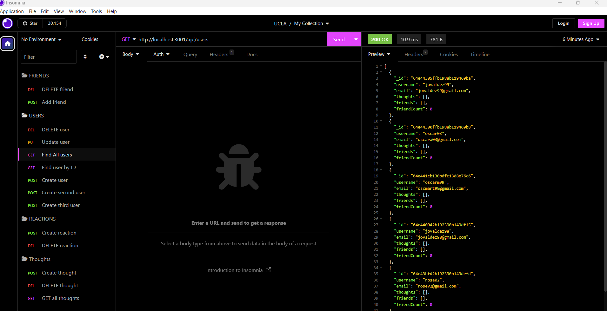

# nosql-sn-api

## Description
The purpose of this project was to build an API for a social network web application where users can share their thoughts, react to friends’ thoughts, and create a friend list. Used Express.js for routing, a MongoDB database, and the Mongoose ODM.

## Usage
To be able to use this application, you need to clone the repository into your local computer.
Then run `npm install` to get all of the dependencies needed. Lastly, run `npm start` to start the server and use Insomnia Core to test all the GET,POST,PUT,DELETE API routes.

## Screenshot

## Walkthrough video
https://watch.screencastify.com/v/DGuZJ2DcGHxXqkj9ZP9x